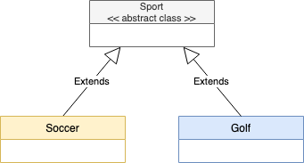

# Behavioral Design Pattern

The Behavioral Design Pattern deals with objects iteration and responsabilities

### Iterator Pattern

Provide a way to access the elements of an aggregate object sequentially without exposing its underlying representation. It's a way to iterate over a collection of data as a List accessing the objects in sequential way without coding much iterate control implementation.

```java
List<String> list = new ArrayList<String>();

list.add("Name A");
list.add("Name B");
list.add("Name C");
list.add("Name D");

Iterator it = list.iterator();

while(it.hasNext())
  System.out.println(it.next().toString()); // All names should be printed
```

### Template Pattern

The Template Pattern is used to define a common structure/behavior for classes. You need an abstract class that define the structure, and its subclasses that will follow this structure. It will help in the code reuse:



Let's see this example:

```java
public abstract class Sport{
	
	abstract start();
	
	abstract play();
	
	abstract stop();
	
	public final void execute(){
		
		start();
		
		play();
		
		stop();
		
	}
	
}

public class Soccer extends Sport{
	
	@Override
	start(){
		System.out.println("Starting the soccer game");
	}

	play(){
		System.out.println("Playing the soccer game");
	}
	
	emd(){
		System.out.println("Stopping the soccer game");
	}	

}

public class Golf extends Sport{
	
	@Override
	start(){
		System.out.println("Starting the golf game");
	}

	play(){
		System.out.println("Playing the golf game");
	}
	
	emd(){
		System.out.println("Stopping the golf game");
	}	

}
```

Testing...

```java
// Just a method os a given class
public static void main(String[] args) throws InstantiationException, IllegalAccessException, ClassNotFoundException {  
          
         Class c =Class.forName(args[0]);
         Game sport = (Sport) c.newInstance();  
         sport.execute();     
       }  
}
```

### References

*	https://java-design-patterns.com
*	https://www.tutorialspoint.com/design_pattern/
*	https://www.javatpoint.com/design-patterns-in-java
