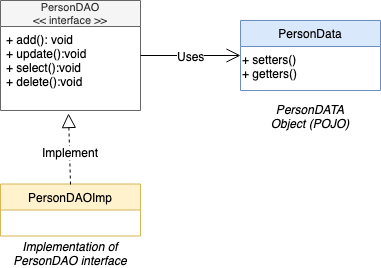

# Persistence Pattern

Persistence Pattern deals with data persistence objects

### Data Access Object Pattern

The Data Access Object (DAO) is used to separed the low level of database operations to the business object layer.

