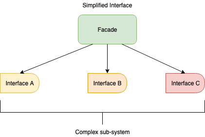

# Structural Design Pattern

The Structural Design Pattern defines the way objects can be composed in a large structure

### Adapter Pattern

The Adapter Pattern permits you use an incompatible object in an adapter to make it compatible with another class. If you have a class A that uses a given interface and would like to use a class B in a compatible way, you can create an "Adapter" class to handle this. Please see below:

```java
public interface Payment{
	
	void processing();
	
}
// Defining the class A
public class CreditCardPayment {
	
	private double amount;
	
	public void setAmount(double amount){
		this.amount = amount;
	};
	
	public double getAmount(){
		return this.amount;
	}
}

// Defining the class B
public class CashPayment implements Payment{
	
	private Payment payment;
	
	public CashPayment(Payment payment){
		this.payment = payment;
	}
	
	@Override
	public void processing(){
	
	}
	
}

// Defining the class "Adapter" between class A and B
public class  CreditCashPaymentAdapter implements Payment{
	
	private CreditPayment credit;
	
	public CreditCashPaymentAdapter(){
		credit = new CreditPayment();
	}
	
	@Override
	public void processing(){
		System.out.println("Credit payment processing amount" + credit.getAmount());
	}
	
}

// Instantiate the class B and pass as parameter a instance of the class A "CreditCardPayment"
CashPayment cashPayment = new CashPayment(new CreditCashPaymentAdapter());
cashPayment.processing(); // Will print the credit card amount
```

### Facade Pattern

Facade Pattern deal with complex set of interfaces, trying to simplify with throught one interface.


Pleas take a look at example below. Imagine a set of steps you need to compose to execute the desired logic, however these steps are spread over many classes, so you can create a Facade Interface class that will simplify this:

```java
public class LetterA{
	
	public void step1(){};
	
}

public class LetterB{
	
	public void step2(){};
	
}

public class LetterC{
	
	public void step3(){};
	
}

public class LetterD{
	
	public void step4(){};
	
}

public class FacadeLetterInterface{
	
	public void processSteps(){
		
		LetterA a = new LetterA();
		LetterB b = new LetterB();
		LetterC c = new LetterC();
		LetterD d = new LetterD();
		a.step1();
		b.step2();
		c.step3();
		d.step4();						
		
	}
	
}
```

```java
FacadeLetterInterface facade = new FacadeLetterInterface();
facade.processSteps();
```
### References

*	https://java-design-patterns.com
*	https://www.tutorialspoint.com/design_pattern/
*	https://www.javatpoint.com/design-patterns-in-java
