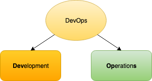
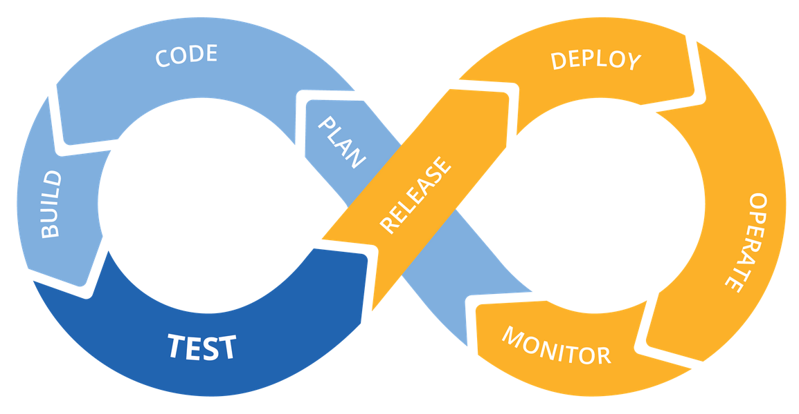

# DevOps

DevOps is a methodology with the main objective to automate the software development phase, building a bridge between development and operations teams/environments

### Statements:

* Software Enginnering practice 
* Automation and Monitoring of Software Development Implementation phases and operational process
* Phases: Integration, Tests, Building, Deployment and Monitoring
* Continuous Implementation
* Create a standard for software developemtn environment
* Puppet é uma ferramenta declarativa, projetada para gerenciar a configuração de Unix-compativeis e Microsoft Windows.
* Continuous Integration (Jenkins) e infrastructure as code (Puppet)

### Foundations:
* Utilization of Agile Methodologies
* High software development demands
* High cloud infrastructure availability
* High data center demand and setup management tools

### Cycle

### References

https://guide.freecodecamp.org/devops/

https://pt.wikipedia.org/wiki/DevOps#cite_note-1

