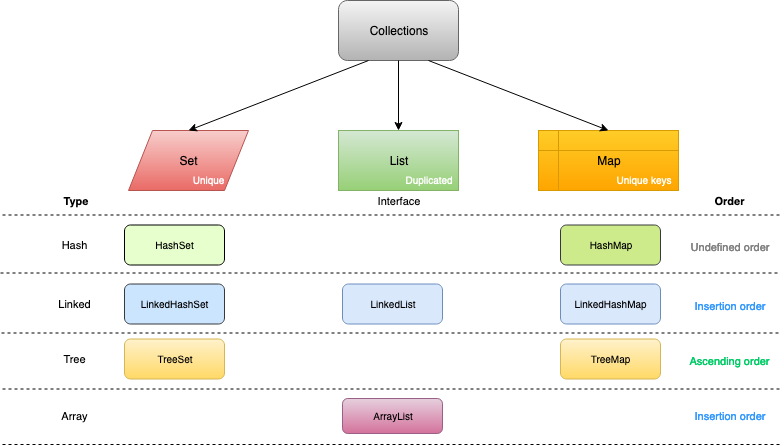
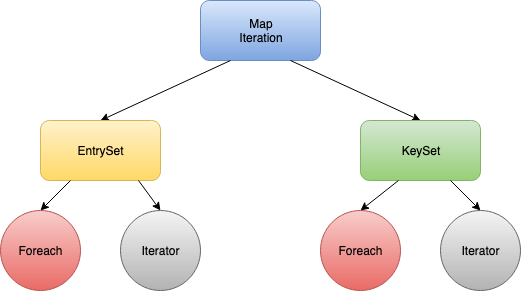

# Java Collections

(Under construction) Map, HasMap and TreeMap

Collections overview



Null and duplicated objects:
* Set: Unique objects, not null objects
* List: Duplicated objects, null objects
* Map: Not duplicated keys, duplicated values

Ordering:
* HashSet/HashMap: unordered
* LinkedHashSet/LinkedList/LinkedHashMap: insertion order
* TreeSet/TreeMap: ascending order

### HashMap

It belongs **java.util** and implements **HashTable** data structure.

* **put()**: Store the object into the backend array. The hashcode() method is used in conjunction with a hash function to find the correct location for the object into the bucket. If a collision occurs then the entry object which contains both key and value is added to a linked list and that linked list is stored into the bucket location

* **put()**: *The same key*, it will replace the old value by the new one, and return the old one

* **required object**: A HashMap object should have **equals()** (used in retrieve) and **hashcode()** (used in insert) methods.

* **removing an element on a transversing map**

```java
Iterator itr = map.entrySet().iterator();

while(itr.hasNext()){
  Map.Entry current = itr.next();

  if(current.getKey().equals("matching"){
     itr.remove(); // removing the current element, HasMap has .remove() but doesn't work in a iteration
  }
}
```

* **HashMap order**: Random order, it iteration will be a new order. You can't sort beacaus it is an unordered collection.

* **HashMap count**: size() ot mappingCount() in java8

* **HashMap collision**: if two keys have the same hashCode they will be stored in the same bucket

* **HashMap syncronized**: Collections.synchronizedMap(new HashMap<K,V>())

### Iteration

Some ways to iterate over a Map



* Using keySet and looping
```java
HashMap<String, String> loans = new HashMap<String, String>();
loans.put("home loan", "citibank");
loans.put("personal loan", "Wells Fargo");
for(String k : loans.keySet()){
  System.out.println("Key: " + k + " Value: " + loans.get(k));
}
```

* Using keySet and Iterator 
```java
Set<String> keySet = loans.keySet();
Iterator<String> it = keySet.iterator();
while(it.hasNext()){
  String k = it.next();
  System.out.println("Key: " + k + " Value: " + loans.get(k));
}
```

* Using EntrySet and looping 
```java
Set<Map.Entry<String,String>> entrySet = loans.entrySet();

for(Entry entry : entrySet){
  System.out.println("Key: " + entrySet.getKey() + " Value: " + entrySet.getValue());
}
```

* Using EntrySet and Iterator
```java
Set<Map.Entry<String,String>> entrySet = loans.entrySet();
Itertor<Entry<String,String>> it = entrySet.iterator();
while(it.hasNext()){
  String entry = it.next();
  System.out.println("Key: " + entrySet.getKey() + " Value: " + entrySet.getValue());
}
```

### HashSet

It does not allow duplicate values and uses **add** method instead of **put** method. It uses **contain** method to check existence of an object, it is a unique list.

```java
HashSet<String> set= new HashSet<String>();
set.add ("first");
set.add ("second");
 
if(set.contains("first")){
	System.out.println("first found");
}
```

### Main difference between Hashtable and HashMap

Hashtable is legacy class and is syncronized, the HashMap should be prefered and it is not syncronized, you should implement sync if needed nby yourself.


### References
https://javarevisited.blogspot.com/2011/12/how-to-traverse-or-loop-hashmap-in-java.html
