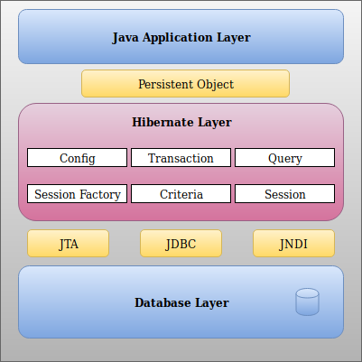

# Hibernate

Hibernate is a framework for ORM (Object Relational Mapping) developed in Java and .Net. The objective is map the **traditional relational database** to **application object model** using XML files or annotations. 

With the Hibernate the developer don't need to care about the SQL implementations, just to the application object model. When a new object should be added, Hibernate will take care of SQL script to add it on database, it is an amazing abstraction for developers.

Let's take a look in the traditional Java database connectivity

### JDBC (Java Database Connectivity)

The JDBC provides APIs to connect Java programs to relational databases as Oracle, DB2, MySQL, etc. Using JDBC you talk with database tables/objects using SQL statements. Let's see another approach, using object relational mapping

### ORM (Object Relational Mapping)

The relational database model is not compatible with object oriented model systems, the objects in the application layer is not directly compatible to relational databases tables and relationships, then the costs and effort to implement the communication between them are high, at leats in complex applications.

Take a look below some mismatchs betweem ORM and Relationa Database:

| Point | Description |
| :---  | :--- |
| Granularity | The number of java objects may be not compatible with the number of tables |
| Inherintance | Java objects has inheritance, but relational tables do not have |
| Identity | Java objects have its owned ID, tables can have customized/composed ids |

There are others...

ORM technique hides SQL implementations and create a mapping between these two words and will manage the transactions automatically.

There are many ORM options as:

* Enterprise JavaBeans
* Java Data Objects
* Spring DAO
* Hibernate
* etc

### Architecture

Let's see the basic communication:


Hibernate is the bridge between thoses worlds

Now, let's see the architecture layer in details:



Let's talk about main Hibernate objects

#### Configuration Object

The Configuration Object is instantiated just once when you start your application. It will load the Hibernate configuration from below setup files:

* **hibernate.cfg.xml**: This file has the database connection definition that will be handle during hibernate start processing.
* **hibernate.properties**: It is the same of hibernate.cfg.xml
* **(classMappingSetup).xml**: These are the files with the mapping between application objects and database tables

#### SessionFactory Object

After configuration object loads configurations from files, it generates the **SessionFactory object** that is a heavyweight object, thread-safe, one per database.

#### Session Object

A session object is created each time you need a connection with the database, it is lightweight and is not thread-safe, so you should not be alive for long time. You should open a session and close it after each database iteraction needed. Persistent objects are saved and retrieved through a Session object.

#### Transaction Object

It represents a unit of work with the database. The transaction object is optional and the application may choose to manage it from their side.

#### Query Object

It uses the SQL (Structured Query Language) and HQL (Hibernate Query Language) 

#### Criteria Object

It is used to create object oriented criteria queries to retrieve objects.

### Environment

The Hibernate has many Java Libraries dependencies. If you are using Maven in your project you can add the dependency below to work with Hibernate 5.4.3

```xml
<dependency>
  <groupId>org.hibernate</groupId>
  <artifactId>hibernate-agroal</artifactId>
  <version>5.4.3.Final</version>
  <type>pom</type>
</dependency>
```

### Configuration file

The first configuration is setup a config file. I will use the **hibernate.cfg.xml** file as below.

```xml
<?xml version = "1.0" encoding = "utf-8"?>
<!DOCTYPE hibernate-configuration SYSTEM 
"http://www.hibernate.org/dtd/hibernate-configuration-3.0.dtd">
<hibernate-configuration>
   <session-factory>
      <property name = "hibernate.dialect">
         org.hibernate.dialect.MySQLDialect
      </property>
      
      <property name = "hibernate.connection.driver_class">
         com.mysql.jdbc.Driver
      </property>
      
      <!-- javaSample is the database name -->
      
      <property name = "hibernate.connection.url">
         jdbc:mysql://localhost/javaSample
      </property>
      
      <property name = "hibernate.connection.username">
         root
      </property>
      
      <property name = "hibernate.connection.password">
         sql01sql
      </property>
      
      <!-- List of XML mapping files -->
      <mapping resource = "Persons.hbm.xml"/>
      
   </session-factory>
</hibernate-configuration>
```

Let's see about those parameters:

| Property | Description |
| :---      | :---        | 
| hibernate.dialect | The "language" need to hibernate talk with database" |
| hibernate.connection.driver_class | The "driver" needed to connect to database |
| hibernate.connection.url | Database URL | 
| hibernate.connection.username | Database username |
| hibernate.connection.password | Database user password |

At the end of the config file we should define the mapping tags with the name of the mapping files

```xml
<mapping resource = "Persons.hbm.xml"/>
```

### Mapping file

Let's see how is a mapping file. 

```xml
<?xml version = "1.0" encoding = "utf-8"?>
<!DOCTYPE hibernate-mapping PUBLIC 
"-//Hibernate/Hibernate Mapping DTD//EN"
"http://www.hibernate.org/dtd/hibernate-mapping-3.0.dtd"> 

<hibernate-mapping>
   <class name = "Persons" table = "Persons">
      
      <meta attribute = "class-description">
         This class contains the Persons details. 
      </meta>
      
      <id name = "id" type = "int" column = "id">
         <generator class="autoincrement"/>
      </id>
      
      <property name = "firstName" column = "first_name" type = "string"/>
      <property name = "lastName" column = "last_name" type = "string"/>
      
   </class>
</hibernate-mapping>
```

You should have the tag **class** with the name of you model object and table name as well. The **id** tag represents the object id and the table key. After, we have the properties that will map the object properties with table fields.


